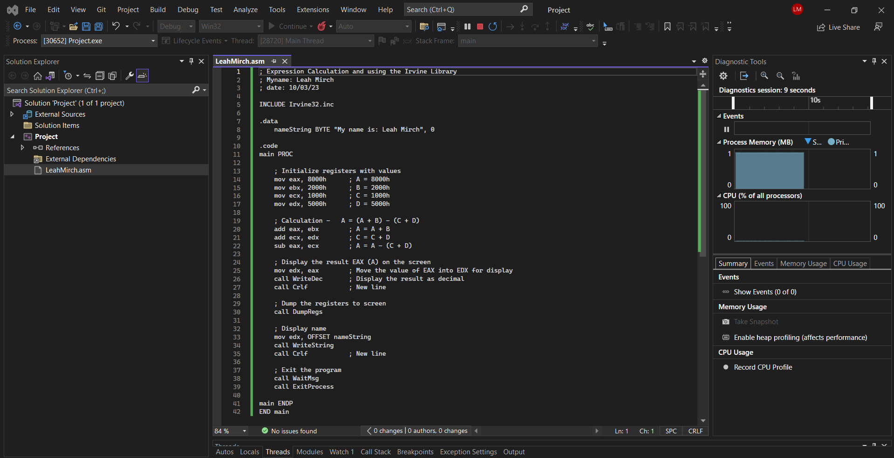
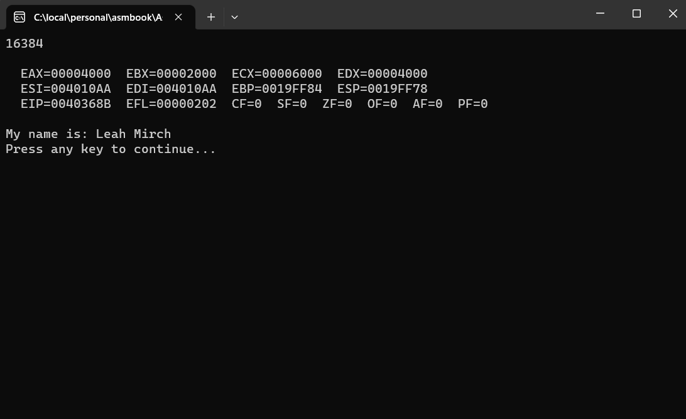
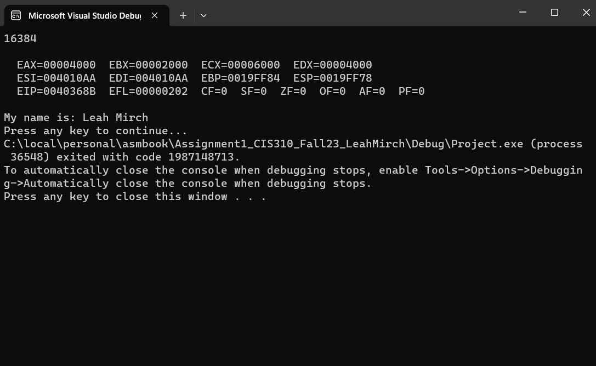

# CIS310: Irvine Library Assembly Language

## Student Name and Email
Leah Mirch (lmirch@umich.edu)

## Introduction
This project demonstrates basic assembly language programming using the Irvine Library. The program performs arithmetic operations on register values, displays the result, dumps register contents, and prints a string.

## Assembly Program Overview
### LeahMirch.asm
This file contains an assembly language program that:
- Initializes registers with hexadecimal values.
- Performs the calculation \( A = (A + B) - (C + D) \).
- Displays the result of the calculation.
- Dumps the contents of all registers to the screen.
- Displays a string "My name is: Leah Mirch".

## Code Explanation
```assembly
; Expression Calculation and using the Irvine Library
; Myname: Leah Mirch
; date: 10/03/23

INCLUDE Irvine32.inc

.data
    nameString BYTE "My name is: Leah Mirch", 0

.code
main PROC

    ; Initialize registers with values
    mov eax, 8000h      ; A = 8000h
    mov ebx, 2000h      ; B = 2000h
    mov ecx, 1000h      ; C = 1000h
    mov edx, 5000h      ; D = 5000h

    ; Calculation -   A = (A + B) - (C + D)
    add eax, ebx        ; A = A + B
    add ecx, edx        ; C = C + D
    sub eax, ecx        ; A = A - (C + D)

    ; Display the result EAX (A) on the screen
    mov edx, eax        ; Move the value of EAX into EDX for display
    call WriteDec       ; Display the result as decimal
    call Crlf           ; New line

    ; Dump the registers to screen
    call DumpRegs

    ; Display name
    mov edx, OFFSET nameString
    call WriteString
    call Crlf           ; New line

    ; Exit the program
    call WaitMsg
    call ExitProcess

main ENDP
END main
```

## Running Instructions
### Prerequisites
- Microsoft Visual Studio with MASM (Microsoft Macro Assembler).
- Irvine32 library installed.

### Compilation and Execution
1. Open the project in Microsoft Visual Studio.
2. Ensure the `LeahMirch.asm` file is included in the project.
3. Build the project.
4. Run the project to see the output.

## Expected Output
The program displays the result of the arithmetic operation, dumps the contents of the registers, and prints the string "My name is: Leah Mirch".

## Screenshots
### Screenshot 1

### Screenshot 2

### Screenshot 3

